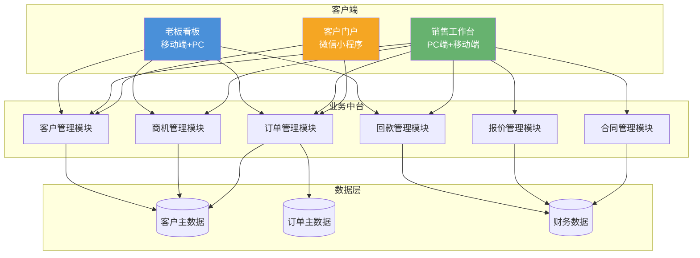

## 1. 客户现状与需求

### 项目概览

| 项目 | 内容 |
|------|------|
| **客户名称** | 温州市国彩真空科技有限公司 |
| **项目名称** | 国彩真空CRM+订单管理系统建设 |
| **项目类型** | 新建 |
| **核心目标** | 实现客户资产沉淀、商机全流程管理、订单透明化，老板实时掌握销售全局 |
| **预计周期** | 一期4-8周，二期扩展 |

### 客户概况

国彩真空在温州做PVD真空镀膜设备，主要产品是卷对卷磁控溅射镀膜机、多弧离子镀膜设备、真空蒸发镀膜机三类，下游客户分布在包装、五金、眼镜镜片这些表面处理行业。订单以非标定制为主，买家集中在长三角和珠三角。

公司规模10-50人，还没进入数字化阶段。老板直接管采购，决策周期短，一般1-4周能定。

### 当前现状与挑战

| # | 挑战 | 影响 | 紧迫性 |
|---|------|------|--------|
| 1 | 客户信息在销售手机里，人走了客户也带走 | 客户资产无法积累 | 高 |
| 2 | 订单进度靠微信问，客户催单催不到点 | 交付逾期风险高 | 高 |
| 3 | 非标设备报价凭经验，成本算不准 | 利润空间不透明 | 中 |
| 4 | 老板看不到签约金额、回款这些数字 | 决策靠拍脑袋 | 高 |
| 5 | 出厂质检记录不全，售后追溯难 | 客诉处理慢 | 中 |

### 核心需求

**一句话总结**：管住客户、理清订单、让老板心中有数。

| # | 需求 | 优先级 | 置信度 | 来源 |
|---|------|--------|--------|------|
| 1 | 客户信息集中化管理，建立统一客户档案库 | P0 | 已确认 | 客户明确提出 |
| 2 | 商机全生命周期管理，从线索到签约标准化 | P0 | 已确认 | 客户明确提出（转化率） |
| 3 | 订单全流程管理，从报价到交付可追溯 | P0 | 已确认 | 客户明确提出 |
| 4 | 老板销售驾驶舱，关键指标可视化看板 | P0 | 已确认 | 客户明确提出（老板看清销售） |
| 5 | 非标设备报价管理，支持BOM+工时成本估算 | P1 | 销售判断 | 由非标定制模式推演 |
| 6 | 回款与应收账款跟踪，逾期预警 | P1 | 销售判断 | 由B2B设备销售特点推演 |
| 7 | 合同全生命周期管理 | P1 | 销售判断 | 由订单规范化需求推演 |
| 8 | 客户运营与复购提醒（耗材更换周期、设备升级推荐） | P2 | 销售判断 | 由提高复购率需求推演 |

### 约束条件

| 约束类型 | 内容 |
|----------|------|
| **预算** | 待确认（需与客户沟通确认范围） |
| **时间** | 待确认（客户有紧迫感，但具体节点未知） |
| **技术** | 客户大概率接受SaaS部署，除非有特殊合规要求 |
| **资源** | 员工数字化素养有限，系统需低学习门槛 |

---

## 2. 解决方案

### 整体思路

国彩真空是典型的温州小厂，CRM建设不能照搬大企业那套打法。思路是**轻量切入、快速见效、分期追加**——先让老板用起来看到数据，再慢慢扩展。

第一期做四个模块：客户、商机、订单、看板。先把散落在微信里的客户捞进系统，让销售开始用系统跟进商机，订单从签合同到交付全程留痕，老板每天看手机就知道签了多少单、哪些单要回款了。这个阶段不贪多，先解决"看得见"的问题。

后面二期加报价、合同、回款，三期再接售后维保和生产对接。分期的原因很简单：小公司资源有限，一次性投入太大老板不敢拍板，先跑通最小闭环、看到效果，再追加预算阻力就小很多。

> 参考方向：制造业CRM轻量化实施方法论 | 成熟度 L2

### 方案架构

### 功能设计

#### 客户管理模块

**解决的问题**：客户信息在销售个人手机里，新人接手找不到历史记录，人走了客户也丢了。

**功能设计**：
- 统一客户档案库：基本信息、联系人（支持多人）、地址、设备台账、历史交易记录
- 跟进记录沉淀：每次电话/拜访/邮件自动留痕，形成完整的客户互动历史
- 公海池机制：销售超过X天未跟进，客户自动掉入公海池重新分配
- 标签体系：按行业、设备类型、合作阶段等维度打标签，便于分层运营

**业务价值**：客户资产从"个人财产"变成"公司资产"，人员变动零损失。

#### 商机管理模块

**解决的问题**：商机跟到哪里了全凭销售一张嘴说，老板心里没底，商机积压和丢单发现不了。

**功能设计**：
- 自定义销售阶段：支持配置「初次接触→需求确认→方案报价→技术评审→商务谈判→签约」等阶段，各阶段停留时长自动统计
- 阶段流转操作：每次推进阶段需填写关键信息（如本次商谈结论、下一步计划）
- 转化率看板：各阶段转化率一目了然，识别瓶颈环节
- 超期预警：商机在某一阶段停留超过设定天数，自动提醒销售和老板
- 输单管理：输单需填写原因，自动沉淀到知识库（"这类需求我们为什么不接"）

**业务价值**：老板随时看到Pipeline全貌，商机转化率可量化追踪。

#### 订单管理模块

**解决的问题**：订单进度靠微信问生产部，客户催单销售也催不动，交付节点靠口头约定容易扯皮。

**功能设计**：
- 订单全生命周期：签约→生产排程→关键节点→出厂验收→交付确认，全程留痕
- 非标设备特殊字段：设备型号、技术参数、定制要求、交付节点（预付款/发货/调试/终验）
- 订单进度可视化：甘特图式进度条，每个节点的完成状态一目了然
- 自动通知：订单状态变更自动通知相关销售和客户（通过微信小程序或短信）
- 逾期预警：订单交付超期前3天自动提醒责任人和老板

**业务价值**：客户可自主查看订单进度，销售从应答催单中解放，交付准时率可量化考核。

#### 老板销售驾驶舱

**解决的问题**：老板想知道今天签了多少单、这个月回了多少款，手下人汇报的数字对不对，只能靠感觉。

**功能设计**：
- 核心指标大屏：本月/本季度签约金额、回款金额、新增商机数、转化率趋势
- 订单交付进度：所有在产订单进度一览，逾期风险标红预警
- 客户Top榜：按签约金额/回款金额排名，看清大客户贡献
- 销售排名：各销售签约/回款对比，支持绩效参考
- 应收账款看板：总欠款额、账龄分布（30天以内/30-60天/60天以上）、逾期高亮
- 移动端优先：老板出差路上手机即可查看，关键指标异常主动推送

**业务价值**：老板每天花2分钟看手机，掌控销售全局，决策有数据支撑。

#### 报价管理模块（可选扩展模块，非一期范围）

如贵司有非标设备报价规范化的需求，可扩展此模块：

- 产品选型配置器：按设备类型（卷绕镀膜机/多弧离子镀/真空蒸发镀）选择配置模板
- 成本估算引擎：支持BOM材料成本+工时成本双维度估算，自动汇总
- 报价单生成：一键生成标准格式报价单，支持导出PDF
- 报价审批流：超过一定金额自动触发老板审批
- 历史报价查询与对比：同一客户/同类设备的报价历史可查，支撑快速报价

> 参考模型：制造业CPQ（Configure-Price-Quote）| 成熟度 L3

#### 回款管理模块（可选扩展模块，非一期范围）

如贵司有回款跟踪规范化的需求，可扩展此模块：

- 回款计划设置：签约时按合同条款设置回款计划（预付款X%、发货前X%、调试后X%等）
- 回款到期提醒：每笔应收款到期前3天自动提醒责任人
- 逾期预警与催收：逾期自动标红，生成催收任务
- 回款统计：实收金额、未收金额、逾期金额实时汇总

**业务价值**：老板清楚知道账上有多少钱、哪些钱该收没收。

### 技术方案

| 维度 | 选择 | 说明 |
|------|------|------|
| **部署方式** | SaaS云端部署 | 无需本地服务器，开箱即用，初始投入低，运维由我方负责 |
| **终端** | 浏览器+微信小程序 | 销售和老板无需安装APP，微信扫码即可使用，降低使用门槛 |
| **数据迁移** | Excel批量导入+人工核对 | 将现有客户数据（微信记录、Excel表格）迁移至系统，保留历史数据。启动阶段第1周需双方共同确认数据梳理方案 |
| **集成** | 微信通知（内置） | 通过企业微信/微信服务号推送订单进度、逾期预警等通知 |
| **扩展性** | 模块化分期上线 | 一期上核心4个模块，二三期按需扩展，无需一次性大投入 |

### 差异化优势

相比通用型CRM（如纷享销客、销售易）：

- **轻量化**：一期4-8周上线 vs 通用CRM实施周期3-6个月，老板能快速看到效果
- **行业适配**：专为非标设备制造商设计，支持设备定制参数、交期节点、回款计划等行业特色字段，通用CRM需大量定制
- **老板视角**：老板驾驶舱从第一天就作为核心模块设计，不是后期叠加，老板能真正用起来
- **非标报价**：内置CPQ能力，支持BOM+工时双维度成本估算，通用CRM通常不具备

---

## 3. 实施路径

### 阶段概览

| 阶段 | 周期 | 核心目标 | 关键交付物 |
|------|------|---------|-----------|
| **启动** | 第1-2周 | 需求确认与数据准备 | 需求确认书签订、现有客户数据导出方案确认、客户现场操作培训 |
| **开发配置** | 第3-6周 | 核心模块上线 | 客户+商机+订单+看板4个模块上线运行 |
| **试运行** | 第7-8周 | 全员使用与问题修复 | 全员试运行、问题收集与修复、老板看板调整 |
| **验收交付** | 第8周末 | 一期验收 | 系统正式上线、操作手册交付、初始数据核对 |
| **二期扩展** | 视一期效果决定 | 报价+合同+回款 | 商务闭环模块上线（可选） |

### 关键里程碑

| # | 里程碑 | 时间 | 验收标准 |
|---|--------|------|---------|
| 1 | 需求确认完成 | 第2周末 | 双方签字确认需求范围，无重大遗漏 |
| 2 | 核心模块上线 | 第6周末 | 客户、商机、订单、看板4个模块可正常运行 |
| 3 | 全员培训完成 | 第7周末 | 销售和内勤能独立操作系统，老板能查看看板 |
| 4 | 一期验收通过 | 第8周末 | 客户信息入库率≥80%，老板每周查看看板≥3次 |

---

## 4. 风险与下一步

### 风险识别与应对

| # | 风险 | 概率 | 影响 | 应对措施 |
|---|------|------|------|----------|
| 1 | 员工抵触录入，怕客户信息透明化后失去对客户的控制 | 中 | 高 | 设计激励政策，将系统使用纳入绩效考核；老板带头推动，营造"用系统是帮公司也是帮自己"的氛围 |
| 2 | 老板期望过高，一次性想解决所有管理问题；或对微信小程序等扩展功能的工作量估计不足 | 中 | 中 | 一期明确聚焦范围（客户+订单+看板），管理期望；用分期建设降低每次决策的门槛 |
| 3 | 现有数据质量差（微信记录混乱、Excel表格不规范），迁移成本高 | 中 | 中 | 启动阶段安排1-2天数据清洗，由我方协助整理历史数据，启动周与客户共同确认数据梳理方案 |
| 4 | 预算超出客户承受范围导致项目搁置 | 低 | 高 | 提供轻量SaaS方案降低初期投入；一期控制在较小预算内验证价值后再扩展 |

### 下一步行动

| # | 行动 | 负责方 | 建议时间 |
|---|------|--------|---------|
| 1 | 安排老板看板Demo演示 | 我方（销售） | 本周内 |
| 2 | 确认预算范围和上线时间期望 | 双方 | 演示后 |
| 3 | 需求细节确认与报价 | 我方（售前） | 确认预算后1周内 |
| 4 | 签订合同与项目启动 | 双方 | 报价后1周内 |

<!-- REVISION_NOTES
## 修订记录
- 第1章：预计周期从"一期4-6周"调整为"一期4-8周"
- 第2章：报价管理、回款管理模块标注为"可选扩展模块，非一期范围"，避免客户误以为必含功能；数据迁移增加启动周共同确认方案说明；差异化优势中周期更新为4-8周
- 第3章：实施阶段增加buffer，启动+开发+试运行周期从6周扩展至8周，关键里程碑时间节点相应顺延
- 第4章：风险2合并"老板期望过高"与"小程序复杂度被低估"两条；风险3增加"启动周共同确认数据梳理方案"的应对措施
-->
